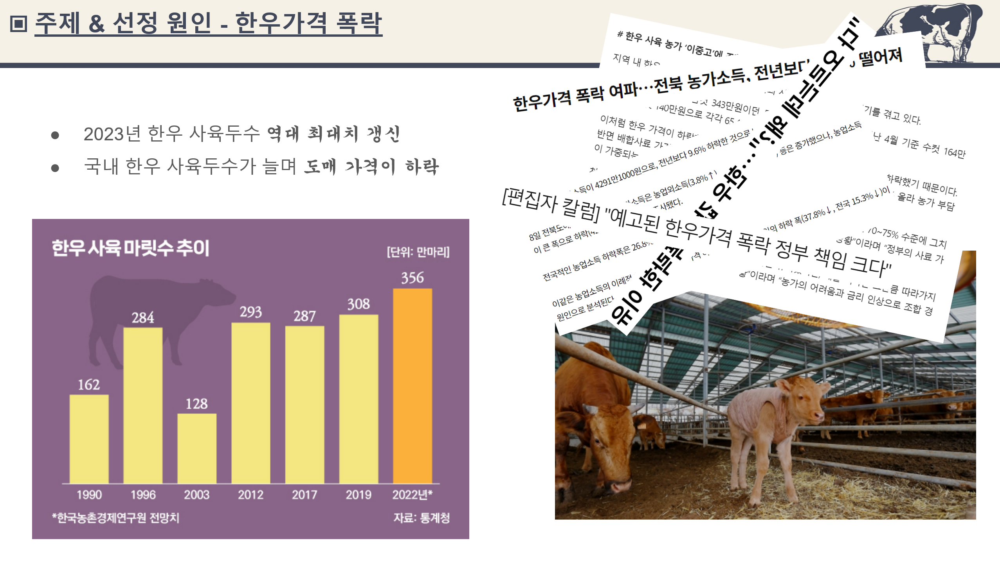
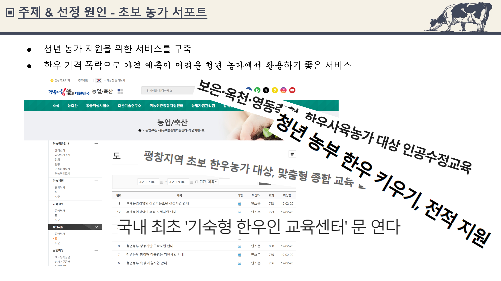
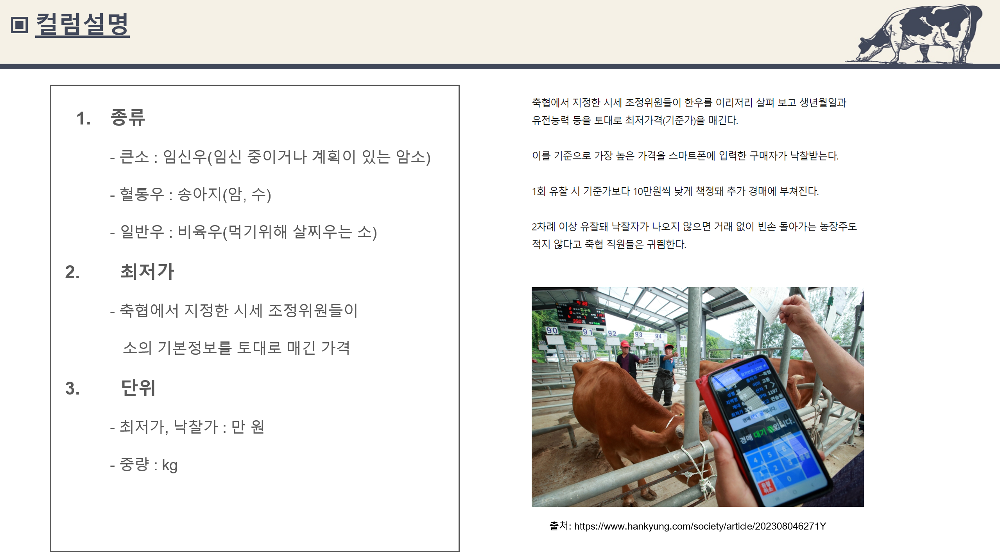
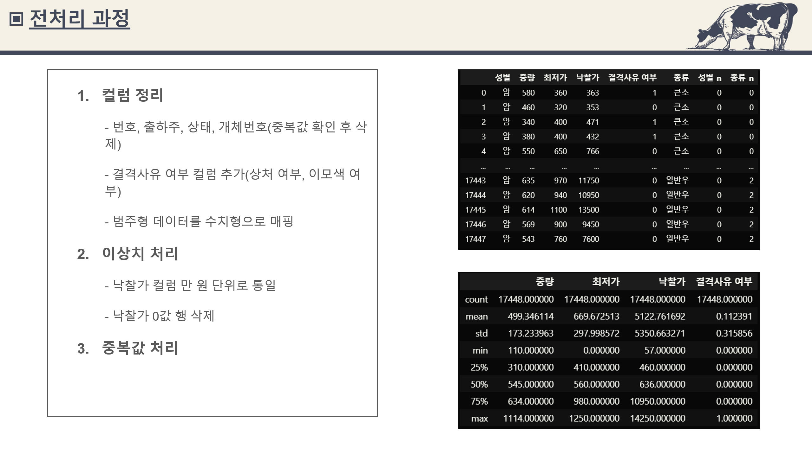
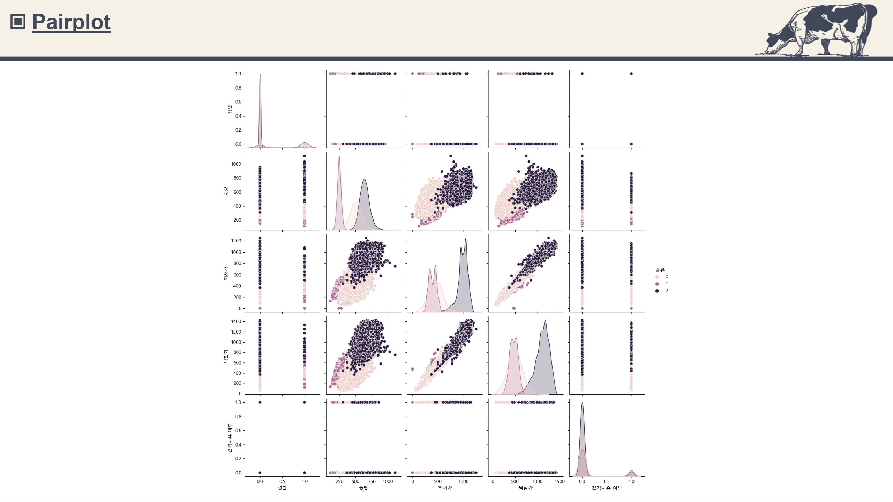
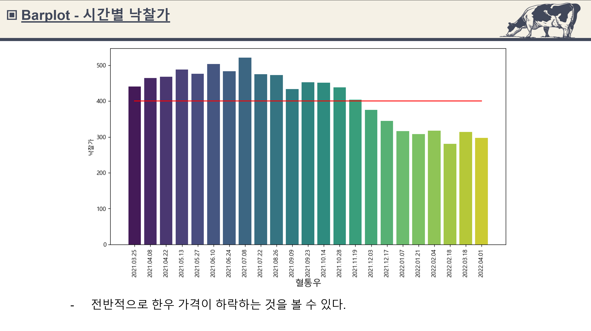
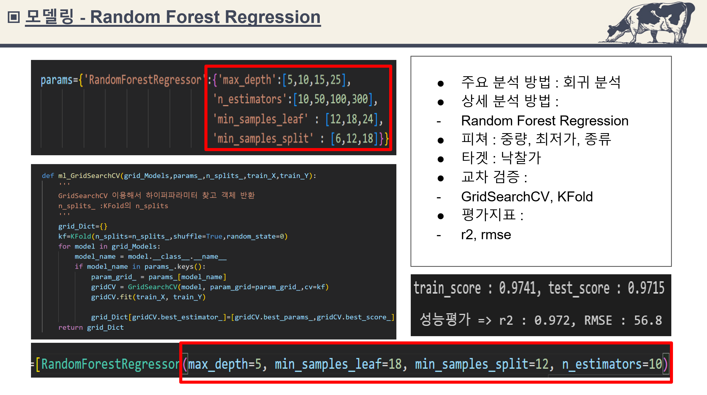
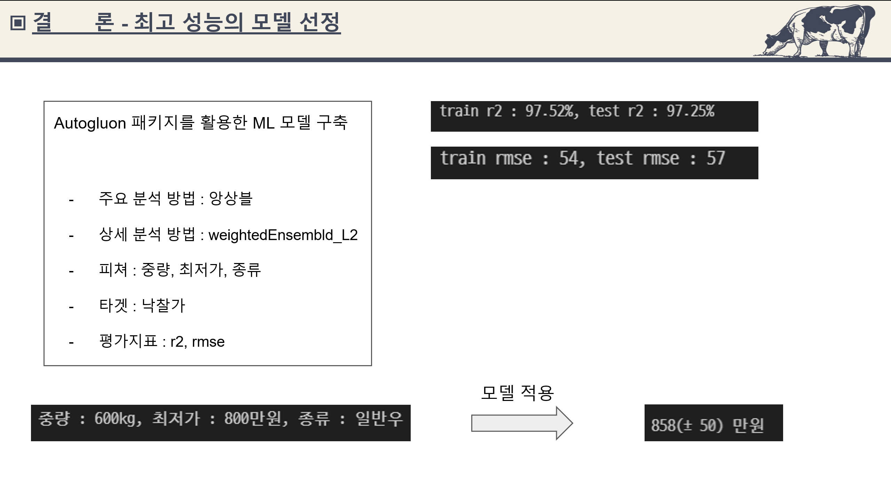
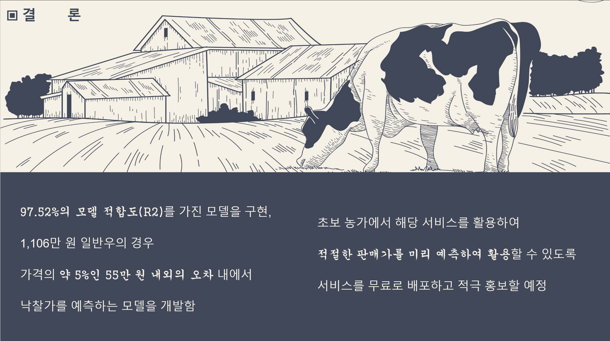

# 🚩 6주차 팀 프로젝트
# **집 가격 예측 서비스**
----------------------------------------------------------

## 🖥️ 프로젝트 소개
-  청년 농가 지원을 위한 서비스를 구축
- 한우 가격 폭락으로 **가격 예측이 어려운** 청년 농가에서 활용하기 좋은 서비스
----------------------------------------------------------

## 🧑‍🤝‍🧑 맴버구성

| 이름 | 작업 영역 | 주요 작업 목록 |
|---|---|---|
| 이태형  | 데이터준비, 데이터분석, 시각화,   Ensemble Regression 모델 구축 | pandas 라이브러리를 활용한 데이터 병합 및 전처리 작업, 결측치 임의 처리,  데이터의 전반적인 분석, 수식 등 구현, sklearn을 이용한 머신러닝 학습
| 김대환  | 데이터준비, 데이터분석, 시각화,   KNN Regression 모델 구축 | pandas 라이브러리를 활용한 데이터 병합 및 전처리 작업, 결측치 임의 처리,  데이터의 전반적인 분석, 수식 등 구현, sklearn을 이용한 머신러닝 학습 | 
| 박선경  | 데이터 분석, 데이터분석, 시각화,   RandomForest Regression 모델 구축 | pandas 라이브러리를 활용한 데이터 병합 및 전처리 작업, 결측치 임의 처리,  데이터의 전반적인 분석, 수식 등 구현, sklearn을 이용한 머신러닝 학습 |
| 나서영  | 데이터 분석,데이터분석, 시각화,   GradientBoosting Regression 모델 구축 | pandas 라이브러리를 활용한 데이터 병합 및 전처리 작업, 결측치 임의 처리,  데이터의 전반적인 분석, 수식 등 구현, sklearn을 이용한 머신러닝 학습 |
| 김찬수  | 데이터 분석,데이터분석, 시각화,   XGBoost Regression 모델 구축 | pandas 라이브러리를 활용한 데이터 병합 및 전처리 작업, 결측치 임의 처리,  데이터의 전반적인 분석, 수식 등 구현, sklearn을 이용한 머신러닝 학습 |

----------------------------------------------------------

## 📂데이터 수집
- 스마트한우경매사이트 : http://www.xn--289al3w02jixo.kr/dev/web/index.html 
- 캐글 : https://www.kaggle.com/datasets/jskim1738/smart-korean-beef-auction

----------------------------------------------------------

## ⚙️ 개발 환경
- **Programming** : `Python 3.9`
- **Framework** : `pandas 2.1.0` `matplotlib 3.7.2` `seaborn 0.12.2`  `numpy 1.24.3` `sklearn 1.3.2` 

----------------------------------------------------------
## 📌 주요 내용

----------------------------------------------------------
## 📓 STACKS
       
