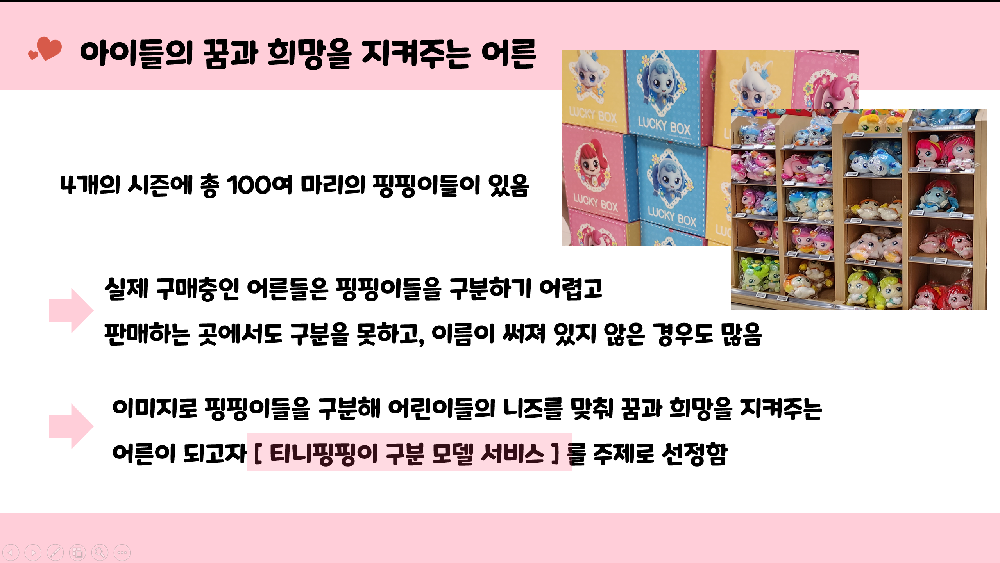
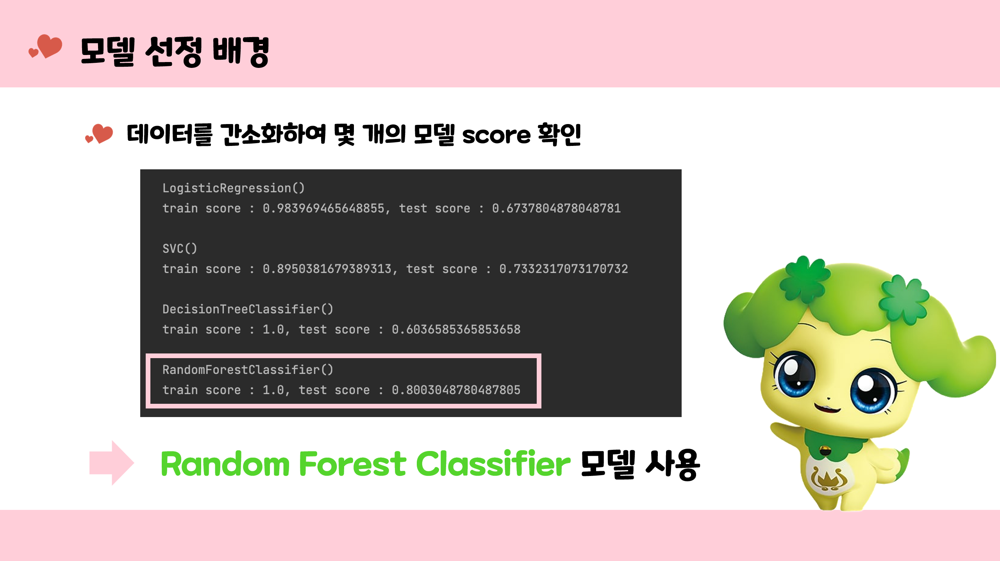
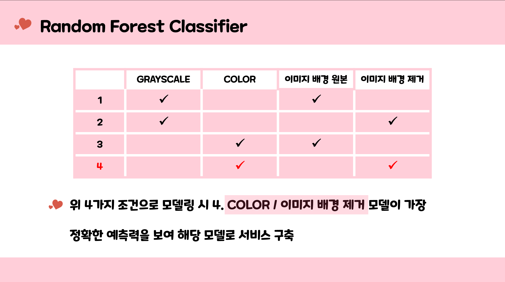
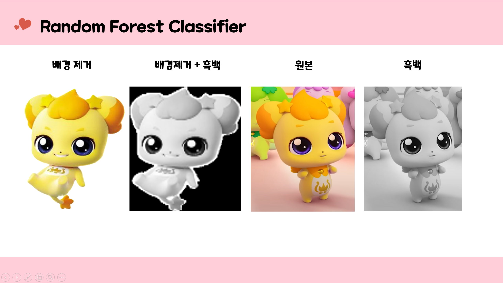
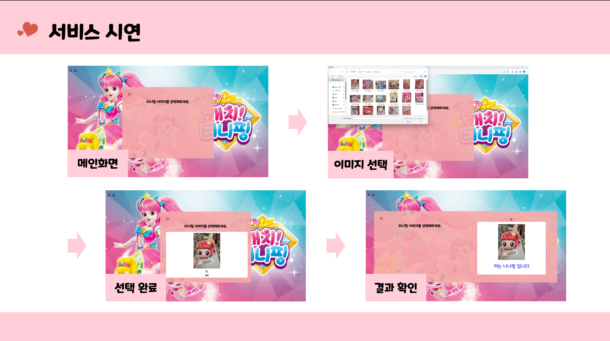

# 🚩 6주차 팀 프로젝트
# **캐치! 티니핑 분류 서비스**
----------------------------------------------------------

## 🖥️ 프로젝트 소개
- 키즈 업계 1위 **캐치!티니핑**의 100여마리 티니핑들을 실제 구매층인 어른들이 구분하기 어려움
- 이미지로 티니핑을 구분하는 **티니핑 구분 모델 서비스** 구축
----------------------------------------------------------

## 🧑‍🤝‍🧑 맴버구성

| 이름 | 작업 영역 | 주요 작업 목록 |
|---|---|---|
| 김근태  | 이미지 수집, 이미지 확장, 모델링 | Fatkun Batch를 활용한 이미지 수집, 수식을 통한 이미지 증폭,  데이터의 전반적인 분석, 수식 등 구현, sklearn을 이용한 머신러닝 학습
| 김찬수  | 이미지 수집, HTML 홈페이지| Fatkun Batch를 활용한 이미지 수집, 웹 인코딩 후 학습 데이터읽기,  페이지 디자인 설계, 페이지 배경음악 삽입 | 
| 박선경  | 이미지 수집, 이미지 확장, 모델링   RandomForest Regression 모델 구축 | Fatkun Batch를 활용한 이미지 수집, 수식을 통한 이미지 증폭,  데이터의 전반적인 분석, 수식 등 구현, sklearn을 이용한 머신러닝 학습 |
| 박소원  | 이미지 수집, 이미지 확장, PPT| Fatkun Batch를 활용한 이미지 수집, 수식을 통한 이미지 증폭,  PPT  제작 | 

----------------------------------------------------------

## ⚙️ 개발 환경
- **Programming** : `Python 3.9`
- **Framework** : `pandas` `matplotlib`  `numpy` `sklearn ` `os` `glob` `cv2` `joblib` `flask`

----------------------------------------------------------
## 📌 주요 내용

----------------------------------------------------------
## 📓 STACKS
       
