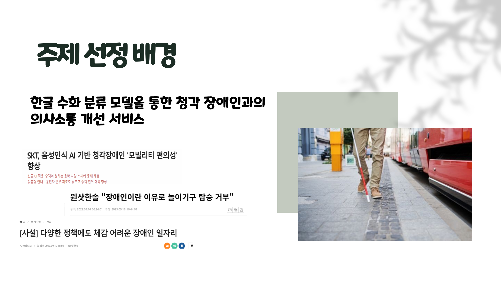

# 🚩 7주차 팀 프로젝트
# **수화 이미지 분류 서비스**
----------------------------------------------------------

## 🖥️ 프로젝트 소개
- 한글 수화 분류 모델을 통한 청각 장애인과의 의사소통 개선 서비스
----------------------------------------------------------

## 🧑‍🤝‍🧑 역할
- 이미지 수집, 이미지 확장  
- CNN 모델 구축

----------------------------------------------------------

## ⚙️ 개발 환경
- **Programming** : `Python 3.9`
- **Framework** : `pandas` `matplotlib`  `numpy` `keras` `os` `glob` `cv2` `flask` `tensorflow`

----------------------------------------------------------
## 📌 주요 내용

----------------------------------------------------------
## 📓 STACKS
       

