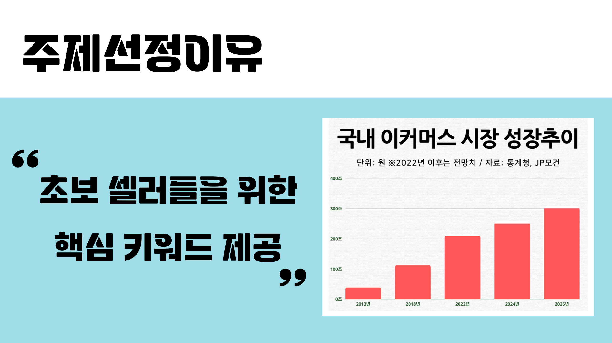
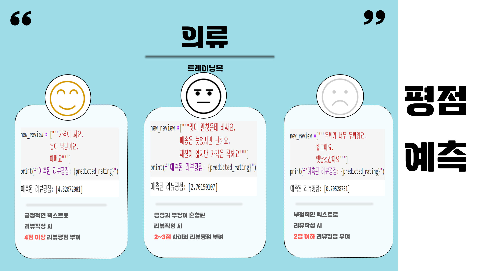
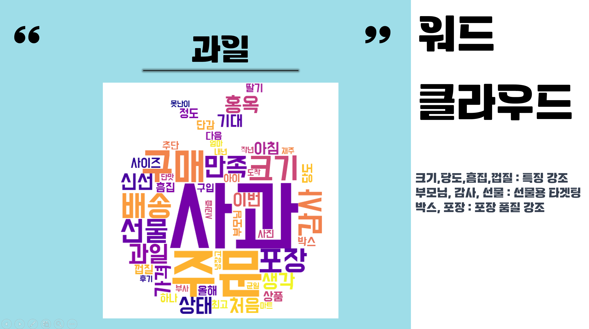
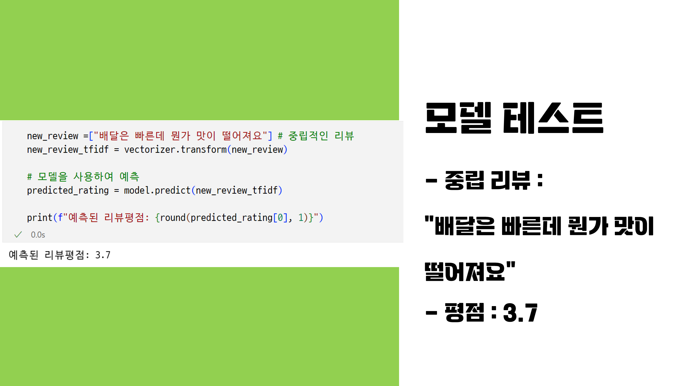

# 🚩 8주차 팀 프로젝트
# **소화전**
- 스마트스토어 초보셀러들을 위한 제품 핵심키워드 제공 및 리뷰 평점 예측.

----------------------------------------------------------

## 🖥️ 프로젝트 소개
-  **crawling** 기능을 사용하여 네이버 스마트스토어 리뷰, 평점 데이터 수집
-  리뷰에 많이 나오는 핵심 키워드 **워드클라우드** 로 생성하기
-  리뷰에 따른 평점 학습모델 만들어서 리뷰에 따른 평점 예측
----------------------------------------------------------

## 🕰️ 개발 기간
* 23.10.02 - 23.10.05
----------------------------------------------------------

## 🧑‍🤝‍🧑 역할
 - 네이버스마트스토어 (트레이닝 의류) 리뷰 크롤링 및 평점 예측 학습모델 구축

----------------------------------------------------------

## ⚙️ 개발 환경
- Python (Version 3.9.0 / Window)
- <strong>Library: </strong> Pandas, Sklearn, Tensorflow, WordCloud, numpy, Okt, matplotlib
- <strong>IDE: </strong> Visual Studio Code

----------------------------------------------------------
## 📓 STACKS
   
 
  

----------------------------------------------------------
## 📌 프레젠테이션
* 주제 선정 이유

* 리뷰에 따른 평점 예측

* 제품별  핵심 키워드 제공 
사과 제품 리뷰 

* 중립 리뷰 평점 예측

