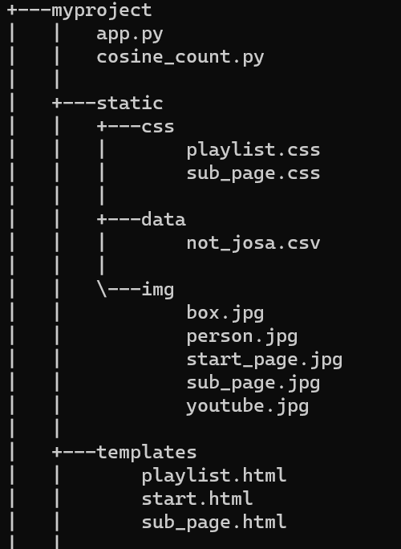
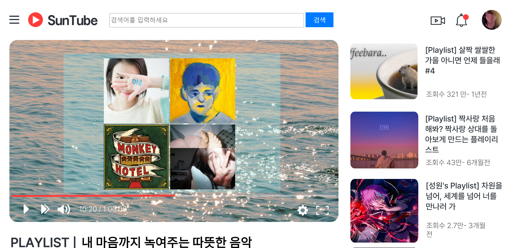
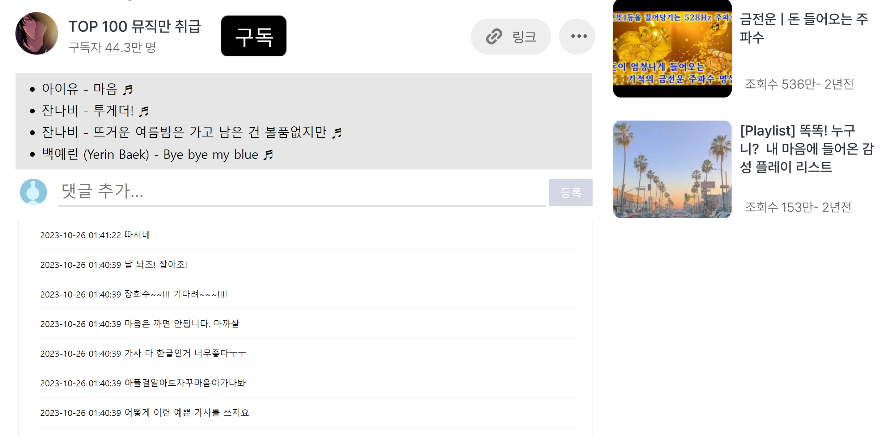

# 🚩 10주차 개별 프로젝트
----------------------------------------------------------
# 🎶나만의 Playlist 만들기
<strong>댓글분석</strong>을 통한 나만의 Playlist 만들기

----------------------------------------------------------
## 🖥️ 프로젝트 소개
댓글에는 사람들의 음악 취향과 감정이 담겨있습니다.
이를 바탕으로 맞춤형 플레이리스트 서비스 제공합니다.
 

----------------------------------------------------------
## 🕰️ 개발 기간
* 23.10.16일 - 23.10.26일

----------------------------------------------------------
## ⚙ 개발환경
- Python (Version 3.9.0 / Window)
- <strong>Framework: </strong> Scikit-learn, Konlpy, Flask, Selenium, Beautifulsoup...
- <strong>IDE: </strong> Visual Studio Code
- <strong>Database: </strong> MariaDB

----------------------------------------------------------
## 🌳Directory Tree

----------------------------------------------------------

----------------------------------------------------------
## 📌 주요 기능
#### 홈 페이지 / 서브 페이지
* 📍 목업

#### 메인 페이지 
* 📍 목업

* 웹 시연

